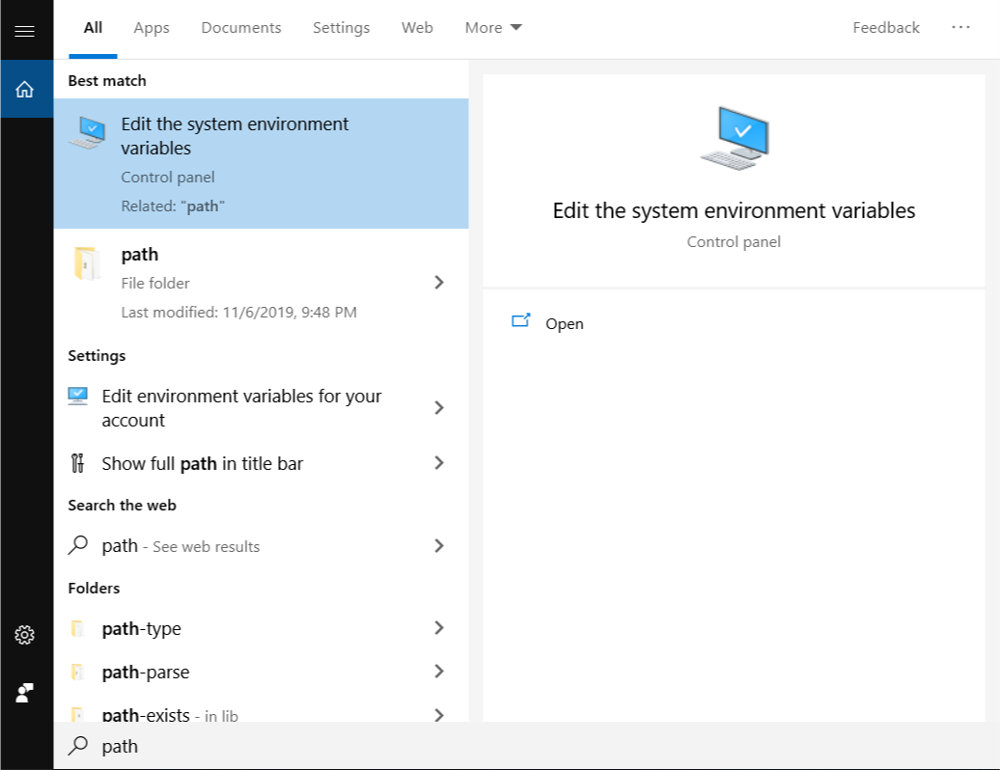
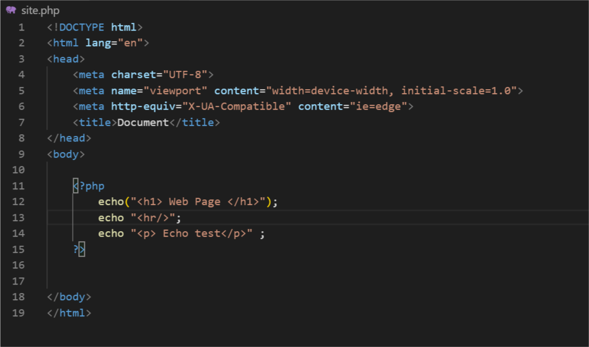
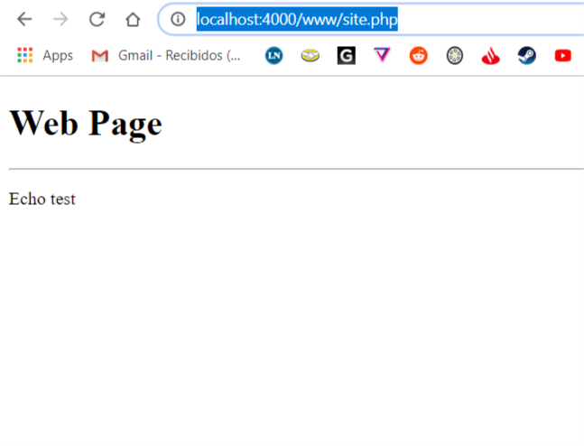

---

title: "Tu primer server PHP"
date: "2019-11-10"

sinopsis: "PHP es un lenguaje que viene desde el año 1995, igual que el JAVASCRIPT. Pero para servers se usa ya desde hace mucho tiempo. Por eso es que hoy sigue teniendo mucha importancia."
tags: [Php]
category: "Back-end"
id: "56"
---

# Empezando!
Como arrancar?

1. ir directo a https://php.net
2. click en downloads.
3. Click en windows downloads de la ultima versión disponible. (stable release)
4. Bajar archivo zip thread safe para nuestra version de sistema operativo, en mi caso x64.
5. Extraer todos los contenidos del zip en C:\php.
6. Agregar el PATH variable a windows.

7. Ir a enviroment variables.
8. Hacer click en PATH, y agregar NEW con dirección en C:\php.
9. abrir CMD y probar si funciona PHP, con el comando php-v
10. Deberia mostrar la versión. Para ejecutar nuestro server, simplemente vamos a dar php -s localhost:4000.
11. El server va estar escuchando en esa dirección, y con eso vamos a poder empezar a codear en PHP.
12. La ruta va estar por defecto en C:\Users\(tuNombreDeUsuario)
13. Ahi crear una carpeta llamada www. y dentro de ella un archivo .PHP, como site.php.
14. Vamos a hacer unas lineas simples, para probar.

15. Vamos en el navegador a http://localhost:4000/www/site.php
16. Deberíamos ver lo siguiente:

ya está funcionando el server!
