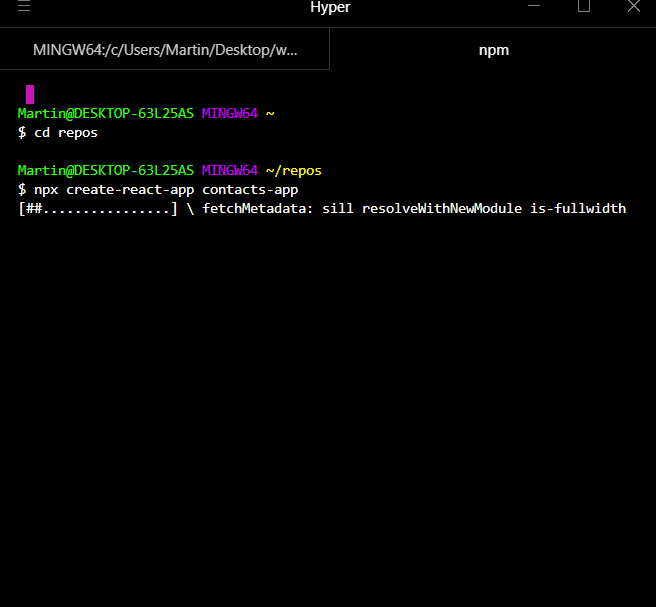
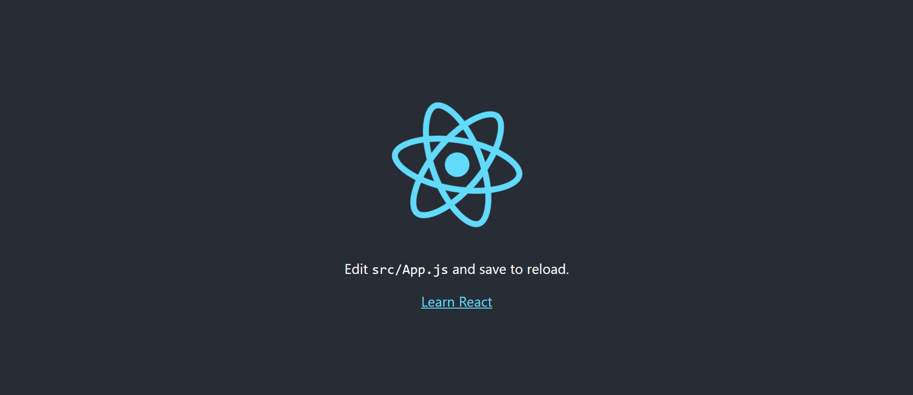
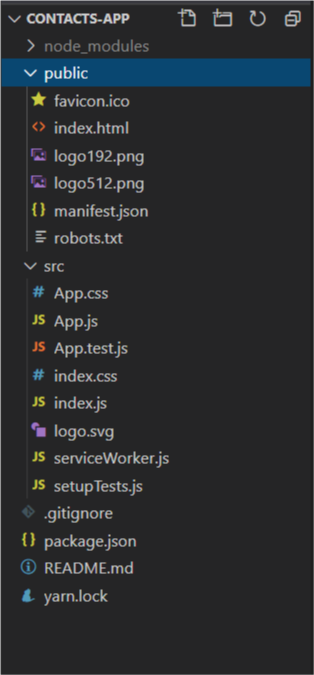
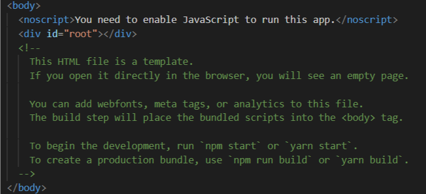
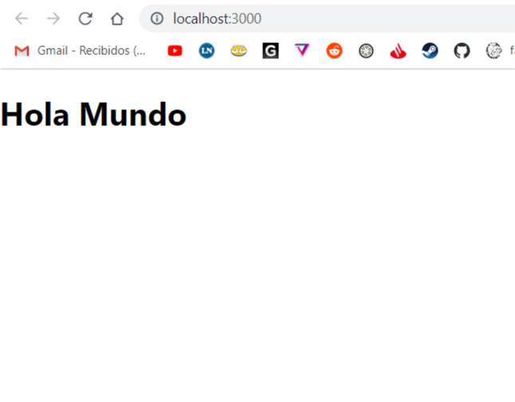
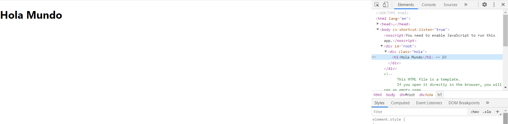

---


title: 'React para principiantes'
date: '2020-07-1'
sinopsis: 'Como y por donde empezar con React?'
tags: [React, Principiantes]
id: "4"
category: "Front-End"


---

Bienvenidos a CodigoMate, mi nombre es Martin, y hoy vamos a ver los contenidos básicos sobre React y como empezar con esta biblioteca.
Este es un tutorial dirigido a principiantes, y para alguien que nunca vio nada de React pero tiene ganas de comenzar a desarrollar con esta gran tecnología.

Primero lo primero, 

### ¿Qué es React?

React, como lo describen ellos mismos en la página oficial, [ver página oficial](https://es.reactjs.org/), es "Una biblioteca de JavaScript para construir interfaces de usuario". 

Entonces, ¿para qué sirve?, pues, para crear páginas, aplicaciones o interfaces web de forma dinámica y utilizando conceptos como reutilización de componentes. 

En react, para hacer una analogía, es como si construyeramos bloques de codigo, cada bloque sería como una especie de pieza lego, que podemos ir reutilizando en muchas partes de nuestro proyecto sin tener que copiar y pegar todo mil veces, entonces una vez que creamos un bloque se vuelve muy fácil reutilizarlo. Y cada bloque permite integrarle variaciones de forma muy fácil con lo cual se hace muy rápido crear código dinámico y reutilizable.

### Lo que vamos hacer

Vamos a codear una aplicación de 0 para guardar contactos, de tipo SPA, en la cual vamos a poder crear, editar y borrar tarjetas de contactos.

*insertar gif*

### ¿Qué necesitamos para este tutorial?

**Requisitos:**  
-Conocimientos básicos de HTML y CSS  
-Concimientos básicos de Javascript  
-Editor de texto  
-Terminal  
-NPM  

**Deseable:**  
-Conocimientos avanzados de HTML   
-Conocimientos intermedios de Javascript  


No es necesario saber tanto de javascript para aprender React se pueden aprender a la par, pero cuanto más sepamos sobre Javascript puro más fácil será el desarrollo. 

Bien, comenzamos entonces:

### ¿Cómo arrancar?

Hay dos formas de arrancar, la primera es configurando todo desde 0, instalando Babel, WebPack, que realmente no lo recomiendo ni yo, ni React oficial como para empezar.

La manera más rapida sin tener mucho que configurar es con create-react-app.
Con create-react-app estariamos haciendo eso, creando una aplicación nueva de React. Con React muchas veces vamos a estar haciendo uso del concepto SPA, que significa Single Page Application. Mas adelante veran porqué exactamente, pero básicamente los sitios y aplicaciones hechas con React son basicamente un sitio de una sola página que va mutando segun la interacción del usuario.

### Arranquemos!
Como mencioné, deberíamos tener NODE instalado. Si no lo tenés instalado vaya a [la pagina de node](https://nodejs.org/en/) y bajese el node, en su última versión LTS. 

Vamos a abrir nuestra terminal, incluso esto podemos hacerlo desde visual studio code usando la terminal del mismo. Si no tenés bash instalado en windows, que viene por defecto en mac y linux, lee acá [como instalar terminal bash en windows](/tutoriales/software/bash)

en nuestra terminal vamos a navegar a la carpeta donde querramos crear el proyecto, y luego vamos a ejecutar los siguientes comandos.

```bash
cd repos
npx create-react-app contacts-app
cd contacts-app
npm start

````




Cuando le demos npm start se nos va abrir automaticamente el navegador y veremos la clásica pantalla de incio de react.


Felicitaciones, ya creaste tu primera aplicación de React, pero por ahora es algo básico que no tiene mucha funcionalidad! Vamos a explorarla un poco.

Para hacer eso, vamos a abrir la carpeta del proyecto en nuestro editor de texto, yo utilizo visual studio code. 
Podemos incluso abrirlo desde nuestra terminal. Con control + C frenamos el proceso de React, y luego vamos a escribir

```bash
code .
```

Esto nos va abrir la carpeta en el visual studio code y podremos explorar un poco toda la estructura de nuestro proyecto. 
Pero básicamente React es una aplicación o página que se generá con javascript interpretado con la ayuda de Babel y claro Webpack, y esta aplicación se inyecta en un archivo HTML.



Observando un poco la estructura, tenemos ademas de nuestra carpeta raíz (root), node_modules, public y src.

**node_modules** contiene todos los archivos relacionados a los paquetes npm. Los paquetes npm son paquetes de codigo hechos por otra persona la cual le podemos agregar a nuestro proyecto. Esto nos da mucha facilidad para integrar funcionalidades ya que hay muy buenos paquetes ya desarrollados para todo tipo de utilidades. Create-react-app viene con bastantes paquetes de por si, los cuales ayudan a comenzar con nuestra aplicacion de forma tan rápida, como vieron solo 3 comandos.

**public** contiene toda la información publica que cualquiera puede ver, y es donde está nuestro archivo principal, el index.html donde inyectaremos nuestra aplicación. Si la exploramos, hay un div con el id root, es alli donde inyectamos nuestra aplicación.



Por último tenemos la carpeta **src** que es el source de nuestro proyecto, la fuente, ahi es donde crearemos todos nuestros archivos de codigo, sea css o javascript el cual luego se interpretaran y se inyectaran en el html público. Si nos metemos en el index.js podemos ver la función render de la clase ReactDom el cual inyecta nuestro codigo en el div root.

```javascript
import React from 'react';
import ReactDOM from 'react-dom';
import './index.css';
import App from './App';
import * as serviceWorker from './serviceWorker';

ReactDOM.render(
  <React.StrictMode>
    <App />
  </React.StrictMode>,
  document.getElementById('root')
);

// If you want your app to work offline and load faster, you can change
// unregister() to register() below. Note this comes with some pitfalls.
// Learn more about service workers: https://bit.ly/CRA-PWA
serviceWorker.unregister();
```


## Dale! Arranquemos a programar!

Bueno, si nos fijamos en el código anterior vemos que se importa App dentro de este archivo que luego inyecta eso al ID root.
Esa APP es nuestro archivo app.js. Allí es donde entraremos para empezar a crear código en react.

Dentro de este archivo veremos lo siguiente, que teniendo concoimientos veremos que es muy parecido al HTML, con algunas diferencias, vean:

```javascript
import React from 'react';
import logo from './logo.svg';
import './App.css';

function App() {
  return (
    <div className="App">
      <header className="App-header">
        
        <p>
          Edit <code>src/App.js</code> and save to reload.
        </p>
        <a
          className="App-link"
          href="https://reactjs.org"
          target="_blank"
          rel="noopener noreferrer"
        >
          Learn React
        </a>
      </header>
    </div>
  );
}

export default App;
```


Podemos dividir este codigo en tres partes.

La primera parte son todas las importaciones 

```javascript

import React from 'react';
import logo from './logo.svg';
import './App.css';

```

Importamos React de la libreria react, luego importamos el logo.svg que simplemente el logo que vemos girar en nuestra aplicacion que os mostre previamente la pantalla, que si han iniciado el server con npm start estaria alocado en la url localhost:3000.
Finalmente estamos importando un archivo css que va a traer todos los estilos.

En la segunda parte tenemos una función Javascript:

```javascript

function App() {
  return (
    <div className="App">
      <header className="App-header">
        
        <p>
          Edit <code>src/App.js</code> and save to reload.
        </p>
        <a
          className="App-link"
          href="https://reactjs.org"
          target="_blank"
          rel="noopener noreferrer"
        >
          Learn React
        </a>
      </header>
    </div>
  );
}

````

Esta función se llama App, y simplemente devuelve algo, que a primera visa es HTML. Y si, es HTML pero tiene otro nombre aquí en React. Se llama JSX. Es muy similar al HTML pero permite integrar javascript directo sin necesidad de utilizar  ` <script> `  tags. 

Otra gran diferencia es que el atributo class, pasa a llamarse className.

Hay más diferencias que las iremos viendo a la par. 

Finalmente encontramos la siguiente expresion

```javascript 

export default App;

```

Esto lo que hace, es indicar que esto es una función para exportar, y esto nos permite, como vimos antes importarla en otro archivo. En el caso de create-react-app la importamos en index.js la cual va a inyectar este componente en el html.

Entonces, vamos a borrar todo, y vamos a escribir nuestro primer componente en React.


Simplemente borren todo menos la primera etiqueta del div, luego vamos a escribir "Hola mundo" dentro del mismo, y le vamos a agregar una clase.

```javascript
import React from 'react';

function App() {
  return (
    <div className="hola">
        <h1>Hola Mundo</h1>
    </div>
  );
}

export default App;

```

Esto nos va a dar este resultado:


y si inspeccionamos en la consola, podemos ver como babel y webpack traducen todo nuestro javascript a html. Fijense que `className="hola"` pasó a ser `class="hola"`



También podemos ver el div root al cual estamos inyectando el JSX.
Estó concluye una breve introducción a React. Se imaginaran que con esto ya podemos hacer lo que se imaginen.
En la proxima sección veremos como crear componentes reutilizables, la diferencia entre componentes de clases y componentes funcionales y más!