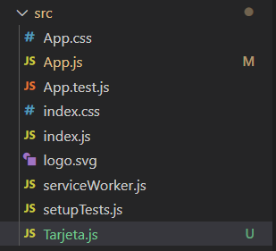
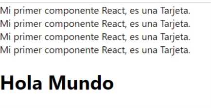
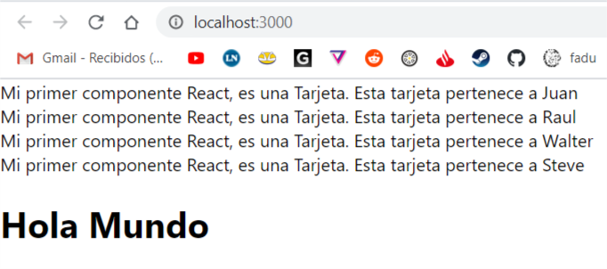
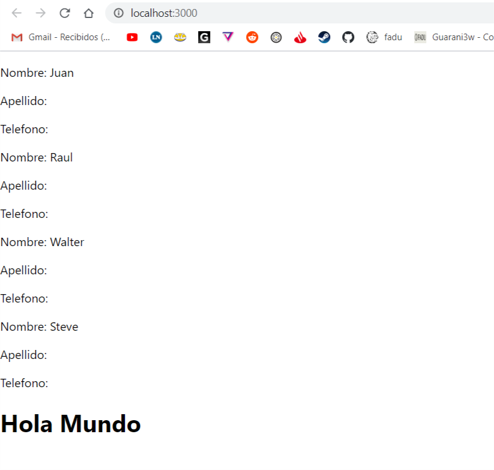
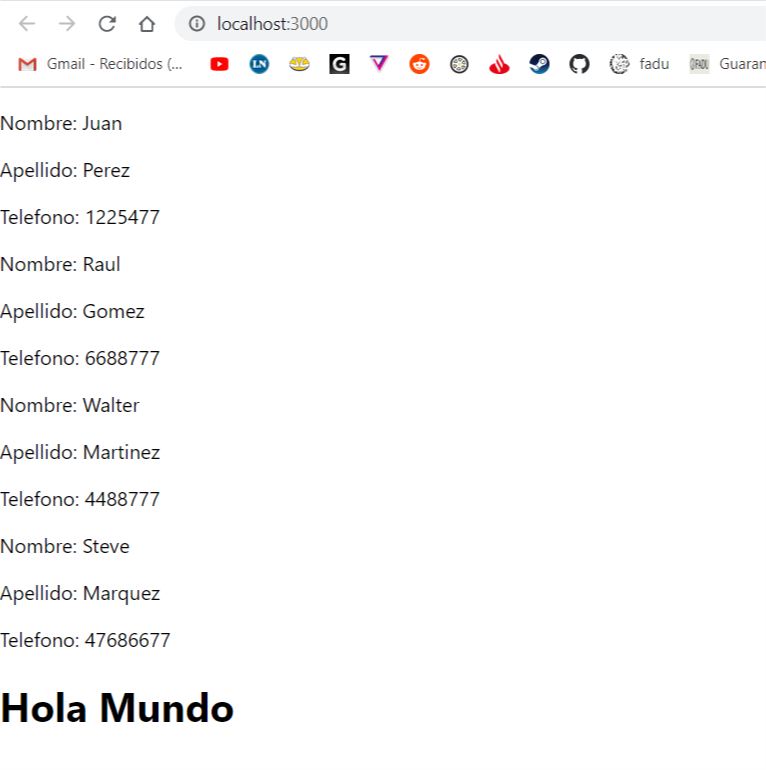

---


title: 'React para principiantes 2'
date: '2020-07-02'
sinopsis: 'Ya sabemos que es react, vamos a escribir nuestro primer componente, veremos exportaciones e importaciones y algunas utilidades del javascript puro'
tags: [React, Principiantes]
id: "5"
category: "Front-End"

---

Anteriormente hicimos una breve introducción sobre qué es React, para que sirve y como es la estructura básica sobre como funciona.

El principio de React más fundamental es poder reutilizar nuestro código, y para hacer esto React nos permite crear componentes.
Hay dos formas de crear componentes, con funciones, y con clases. Nos vamos a centrar en componentes funcionales ya que pareciera ser que el soporte oficial está migrando hacia ese lado.

Entonces, como vamos a crear una aplicación para guardar **contactos** vamos a crear un componente reutilizable, en forma de tarjeta de contacto, el cual vamos a replicar por cada contacto. En vez de hacer copy paste por cada contacto y editar de forma manual cada tarjeta, vamos a tener la informacion de nuestros contactos por nuestro lado, y el codigo de la tarjeta por otro lado, y por cada contacto vamos dejar que nuestro codigo cree la tarjeta de manera **dinamica**.

## Nuestro primer componente

Dentro del editor de texto vamos a crear un nuevo archivo. Puede tener cualquier nombre, nosotros le vamos a poner tarjeta. Se suele por convención ponerle mayuscula al archivo pero no hace falta, entonces quedaria dentro de la carpeta src un nuevo archivo llamado `Tarjeta.js`



y dentro de este archivo vamos a crear una nueva función.
Antes vamos a importar el paquete de React. Esto es importante, tenemos que importarlo siempre que creemos un nuevo componente.
Luego la función que va a devolver el JSX puede ser una función declarada con la palabra function como fue declarada nuestro App.js, o puede ser un arrow function del es6 como lo haremos ahora:

Quedaría algo así.
```jsx
import React from 'react'

const Tarjeta = () => {
    return (
        <div>
            Mi primer componente React, es una Tarjeta.
        </div>
    )
}

export default Tarjeta

```

Es muy importante respeter la estructura, e incluir el export al final. Sin esa declaración no podremos importarla en otras partes.
Vamos a ver como funciona la incorporacion de nuestro nuevo componente, y para eso lo incorporaremos en nuestro componente Padre, el App.js

Primero la importamos, y luego la inyectamos en nuestro JSX simplemente declarandola como si fuese un tag HTML pero con nuestro nombre, Tarjeta.
en App.js: 

```jsx

import React from 'react';
import Tarjeta from './Tarjeta';


function App() {
  return (
    <div className="hola">
        <Tarjeta />
        <Tarjeta />
        <Tarjeta />
        <Tarjeta></Tarjeta> 
        <h1>Hola Mundo</h1>
    </div>
  );
}

export default App;


```

Vemos que se puede cerrar por si solo el tag, o se puede poner un tag de cierre. Esto va a depender de las caracteristicas que le pongamos. Pero las veremos mas adelante. Por ahora con que se cierre solo esta bien, en ingles un self-closing tag.

Esto, si todo salió bien nos va a mostrar 4 veces nuestro componente tarjeta antes del hola mundo, vamos a ver:


Ahora, ya podrán ver si se imaginan la utilidad de esto. Si tenemos componentes complejos es mucho más limpio ver el tag de tarjeta 4 veces, que un largo pedazo de codigo repetido por 4.

Por si solos estos componentes no aportan mucho, pero lo que se puede hacer es pasarle diferentes propiedades, **props**, a cada uno de los componentes, con lo cual podremos darle data dinámica. Imaginen que cada Tarjeta tenga un contacto diferente, cada tarjeta deberia tener un **Nombre**, **Apellido**, **Telefono**, y quizá foto distinta. Pero la estructura de HTML sería igual, solo cambiaria el contenido, o las propiedades. 

Bueno, vamos a presentar estos conceptos aplicandolos primero con la propiedad nombre. A cada tarjeta le pasaremos un Nombre diferente, a través de atributos custom, que son los props. Nuestra "Tarjeta" quedaria asi `<Tarjeta nombre="Juan" />`

Veamos mejor, como a cada tarjeta le pasamos un nombre distinto:

```jsx
import React from 'react';
import Tarjeta from './Tarjeta';

function App() {
  return (
    <div className="hola">
        <Tarjeta name="Juan" />
        <Tarjeta name="Raul" />
        <Tarjeta name="Walter"/>
        <Tarjeta name="Steve"/>
        <h1>Hola Mundo</h1>
    </div>
  );
}

export default App;

```

Ahora, si chequeamos nuestro navegador, no vamos a ver diferencia alguna. Para ver una diferencia, tenemos que editar nuestro componente Tarjeta para que acepte esta nueva propiedad llamada name y la muestre, obvio, ¿por qué sino para que nos serviría?

Vayamos a nuestro componente Tarjeta, y vamos a pasarle un parametro a nuestra funcion Tarjeta, llamado props. Dentro de ese parametro vamos a tener todos nuestros props pasados a través del JSX padre, en nuestro caso App.js.

Veamos que pasa si hacemos un console.log de props. Deberiamos ver, 4 console logs, ya que tenemos 4 componentes Tarjeta.

Tengamos en cuenta que antes del return podemos escribir cuanto codigo querramos en javascript y este se ejecutara antes de devolver el JSX.

```jsx
import React from 'react'

const Tarjeta = (props) => {

    console.log(props)


    return (
        <div>
            Mi primer componente React, es una Tarjeta.
        </div>
    )
}

export default Tarjeta


```
Ahora veamos la consola:


Efectivamente, vemos 4 logs. Son objectos ya que props es un objeto. Pero vemos que dentro de props está nuestro atributo custom llamado Name, y a partir de eso vemos los valores que pasamos. Ahora como podemos usar esto para mostrarlo en nuestro HTML. Es muy simple, y esto es lo que hace tan hermoso al JSX. Podemos inyectar directamente valores de variables, o constantes directamente a nuestro JSX y verlo reflejado. Tal cual de esta manera:

```jsx
const Tarjeta = (props) => {
    console.log(props)
    return (
        <div>
            Mi primer componente React, es una Tarjeta.
            Esta tarjeta pertenece a {props.name}
        </div>
    )
}
```

Y veremos lo siguiente: 



Ahora, nuestra función tarjeta se puede mejorar un poco más usando el destructuring del es6, esto nos va limpiar un poco mas el codigo, ya que en vez de tener que repetir props todo el tiempo, podemos obviar props directamente. Esto es especialmente util cuando tenemos muchas propiedades, voy a hacer un cambio grande a nuestro componente tarjeta, pero no deberia ser dificil de seguir:

```jsx
import React from 'react'

//Vean el destructuring dentro del parentesis
const Tarjeta = ({name, lastname, phone}) => {
    return (
        <div>
          <p>Nombre: {name}</p>
          <p>Apellido: {lastname}</p>
          <p>Telefono: {phone}</p>
        </div>
    )
}

export default Tarjeta
```

Como por ahora no tenemos ni lastname ni phone, vamos a ver esa informacion vacía. Pero ya se va asemejando a una estructura de tarjeta de contacto.



Vamos a volver a nuestro App.js y vamos a ponerle data a cada una de nuestras tarjetas para tenerlas completas.

```jsx
import React from 'react';
import Tarjeta from './Tarjeta';


function App() {
  return (
    <div className="hola">
        <Tarjeta name="Juan" lastname="Perez" phone="1225477" />
        <Tarjeta name="Raul" lastname="Gomez" phone="6688777"  />
        <Tarjeta name="Walter" lastname="Martinez" phone="4488777" />
        <Tarjeta name="Steve" lastname="Marquez" phone="47686677" />
        <h1>Hola Mundo</h1>
    </div>
  );
}

export default App;
```
Ya se imaginaran como queda esto:



Ahora, no es muy dinámico ni práctico copiar y pegar los atributos dentro de cada tarjeta que creamos. Ciertamente se puede hacer así pero va encontra de un poco de todo el sentido de React que es reutilizar código y hacer todo más eficiente.

Por ejemplo, para evitar esto podemos hacer utilidad de **javascript**, y armar un array con toda nuestra data de los contactos, el dia de mañana por ejemplo la data puede venir de una fuente externa, y por cada uno de los contactos mostraremos una tarjeta. Como, pues asi:

```jsx
import React from 'react';
import Tarjeta from './Tarjeta';


function App() {

  //Primero creamos un array, ya que tenemos màs de un contacto, ahi guardaremos toda nuestra información sobre nuestros contactos.

  const contacts = [
    //ya que cada contacto tiene más de una propiedad, contacts será un array de objetos.
    {
      name: "Juan",
      lastname: "Perez",
      phone: "1225477"
    },
    {
      name: "Raul",
      lastname: "Gomez",
      phone: "6688777"
    },
    {
      name: "Walter",
      lastname: "Martinez",
      phone: "4488777"
    },
    {
      name: "Steve",
      lastname: "Marquez",
      phone: "47686677"
    },

  ]

  //Luego a travès del prototpio map, vamos a crear un nuevo array a partir de nuestro array contacts, el cual devolvera
  //una tarjeta por cada contacto. Todo esto viene del javascript puro

  const contactsMap = contacts.map((contact) => {
    //siempre que hagamos un map de elementos en react, el componente padre, que en este caso es Tarjeta ya que hay uno solo debera
    //tener una propiedad llamada key, la cual debe ser unica por cada elemento mapeado.
    //esto es algo de react que ayuda al renderizado
    //En nuestro caso algo que es unico para cada contacto es el telefono, ya que pueden haber nombres o apellidos repetidos.
    return(
      <Tarjeta key={contact.phone} name={contact.name} lastname={contact.lastname} phone={contact.phone} />
    )
  })

  //Luego nos queda plasmar esto en el return del componente Tarjeta.
  // es simplemente hacer referencia  a nuestro contactsMap entre corchetes:
  return (
    <div className="hola">
        {contactsMap}
        <h1>Hola Mundo</h1>
    </div>
  );
}

export default App;
```

Verán que esto les arroja el mismo resultado de antes, pero con menos codigo, ahora puede que sea mas pero imaginen si tienen 150 contactos. 

Para limpiar aun más nuestro App.js podemos quitar nuestro array de contactos y moverlo a un nuevo archivo.
Crearemos un nuevo archivo llamado contacts.js y pegaremos allí nuestro array de contactos asi:

```javascript

  export default [
    {
      name: "Juan",
      lastname: "Perez",
      phone: "1225477"
    },
    {
      name: "Raul",
      lastname: "Gomez",
      phone: "6688777"
    },
    {
      name: "Walter",
      lastname: "Martinez",
      phone: "4488777"
    },
    {
      name: "Steve",
      lastname: "Marquez",
      phone: "47686677"
    },

  ]

```

y finalmente lo importaremos en nuestro App.js
el cual, sin comentarios quedaría así:

```jsx
import React from 'react';
import Tarjeta from './Tarjeta';
import contacts from './contacts.js'

function App() {
  const contactsMap = contacts.map((contact) => {
    return(
      <Tarjeta key={contact.phone} name={contact.name} lastname={contact.lastname} phone={contact.phone} />
    )
  })

  return (
    <div className="hola">
        {contactsMap}
        <h1>Hola Mundo</h1>
    </div>
  );
}

export default App; 
```

El resultado que vemos en nuestro navegador es el mismo, pero es muchisimo mas limpio de esta manera. Tenemos nuestros contactos separados en un archivo unico de ellos, y solo trabajamos con la data referenciandola a través de la importación. Y cada contacto que agreguemos en ese array lo veremos automaticamente reflejado en nuestro front end.


Con esto cerramos este capitulo, vimos creacion de componentes, importaciones y exportaciones, y como podemos usar javascript puro para trabajar nuestra data.

En el proximo capitulo le daremos un poco de estilo a nuestros contactos usando un paquete externo, veremos implementacion de paquetes, css, y más!