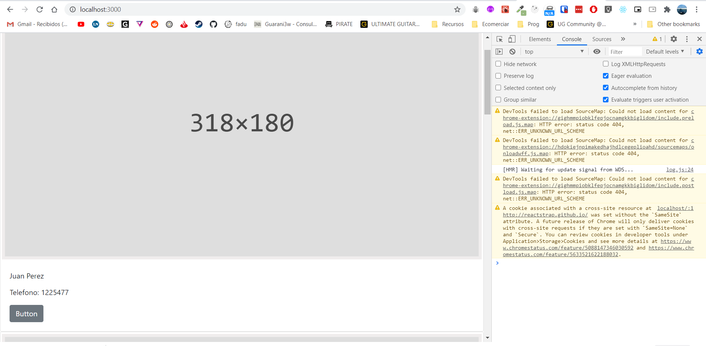
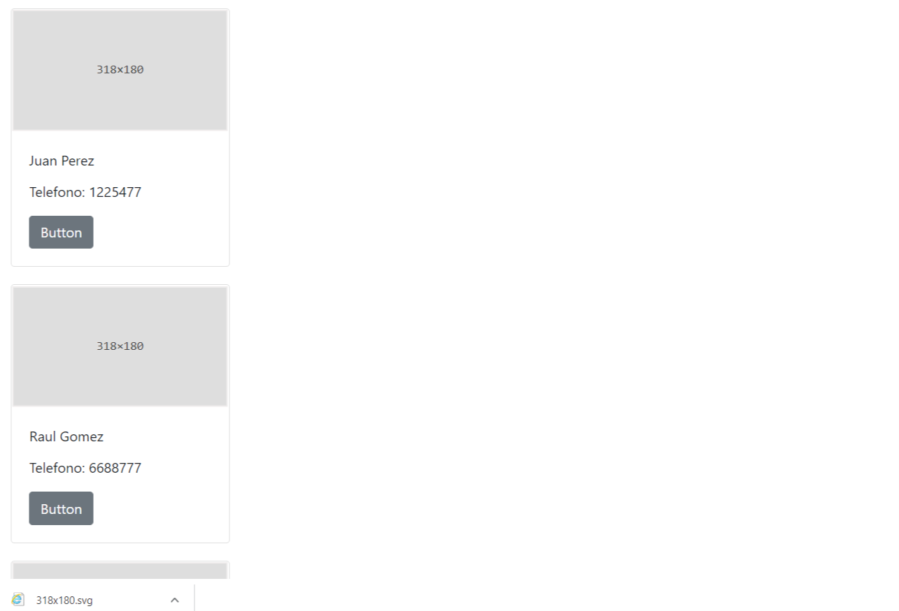
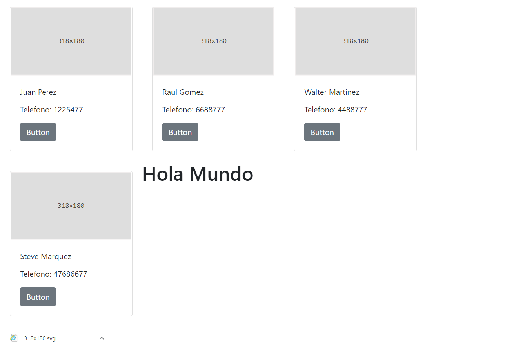

---


title: 'React para principiantes 3'
date: '2020-07-03'
sinopsis: 'Ya escribimos nuestro primer componente y logramos usarlo. Vamos a instalar algunos paquetes para poder estilar nuestra aplicación y que se vea mejor'
tags: [React, Principiantes]
id: "6"
category: "Front-End"

---


Bueno, ya se que es caer un poco en la básica, en la vieja confiable, pero le vamos a agregar bootstrap a nuestra aplicación para darle un poco de estilo, y que no sea tan dura y de solo texto. Para agregarle bootsrap a react vamos a hacerlo de la siguiente manera, con **reactstrap**.

Reactstrap es la forma más fácil de agregarle bootstrap a nuestro proyecto react. Chequeen la página de [reactstrap](https://reactstrap.github.io/)

Simplemente, en nuestra consola, vamos a parar el server de desarrollo de react haciendo control + c, y vamos a darle el siguiente comando.

```bash
npm install --save bootstrap
npm install --save reactstrap

```

Luego en nuestro App.js vamos a agregar una nueva linea de importaciones, basicamente vamos a importar el css de bootstrap.

```jsx
import React from 'react';
import Tarjeta from './Tarjeta';
import contacts from './contacts.js';
import 'bootstrap/dist/css/bootstrap.min.css';

```

Ya con esto, vamos a poder importar cualquier componente de la libreria de reactstrap. Nosotros vamos armar una tarjeta para cada contacto, con lo cual podemos importar varias cosas que nos van a mejorar bastante la presentación.

Primero vamos a importar Card de bootstrap, y vamos armar el JSX de una forma en la cual podamos presentar nuestra información. Vamos a volver a nuestro archivo Tarjeta.js y alli importaremos varias cosas, y luego armaremos el esquema en JSX.

La imágen por ahora vamos a sacarla directo de reactstrap, ya que por ahora vamos a dejar el placeholder momentaneamente.

```jsx

import React from 'react'
import {
  Card, CardImg, CardText, CardBody,
  CardTitle, Button
} from 'reactstrap';
//Vean el destructuring dentro del parentesis
const Tarjeta = ({name, lastname, phone}) => {
    return (
        <Card>
          <CardImg top width="100%" src="https://reactstrap.github.io/assets/318x180.svg" alt="Card image cap" />
          <CardBody>
          <CardTitle>{name} {lastname}</CardTitle>
          <CardText>Telefono: {phone}</CardText>
          <Button>Button</Button>
        </CardBody>
        </Card>
    )
}

export default Tarjeta

```

Vean que ya no hace falta más el div que contenía a nuestra data. Ahora si le dan guardar veran unas cartas enormes:



Para dejarlo mas manejable vamos aprender un nuevo concepto en React, que es el inline styling.

En HTML comun para meter un inline-style hay que hacerlo de esta manera: `<div style="max-width: 250px"></div>`

Pero en react es un poco diferente, ya que se trabaja de otra manera, como si fuera un objecto en javascript. A continuacion le vamos a dar a nuestro componente card un **max-width** de 250px y 20px de **margen**:

```jsx
<Card style={{maxWidth: "250px", margin: "20px"}}>
```

Fijensé que el guíon se cambia por un camelcasing, con lo cual max-width pasa a ser maxWidth y por ejemplo margin-top pasaría a ser marginTop

Entonces, una vez agregado los estilos vamos atener un resultado así:



Finalmente vamos a darle un poco de estilado al contenedor de todos nuestros contactos a través de css en nuestro App.js
Recuerden que nuestro contenedor padre en App.js tenía la clase *hola*.

Al principio habíamos borrado la importación del App.css, asi que la volveremos a incluir. Para archivos css es simplemente importarlo,
`import './App.css`

Lo que sí, borren todo, solo quedará una cosa en nuestro App.css que es lo que agregaremos a continuación.

Para mostrar todas las tarjetas de una forma fluida, una al lado de la otra vamos a usar flex-box.
Entonces dentro de nuestro css vamos a invocar a la clase .hola y agregaremos lo siguiente

```css
.hola {
  display: flex;
  flex-direction: row;
  flex-wrap: wrap;
}
```
Y ahora podemos ir viendo algo más parecido al resultado final. Aunque deberíamos ya borrar el hola mundo el cual no tiene mucha utilidad.




Entonces, vimos como agregar la libreria externa, o el paquete de react-strap, que es basicamente Bootstrap para React, y vimos como importar archivos css a nuestro proyecto. En el proximo tutorial veremos como podemos hacer para poder agregar y quitar contactos, y para eso introduciremos el concepto de estado. 