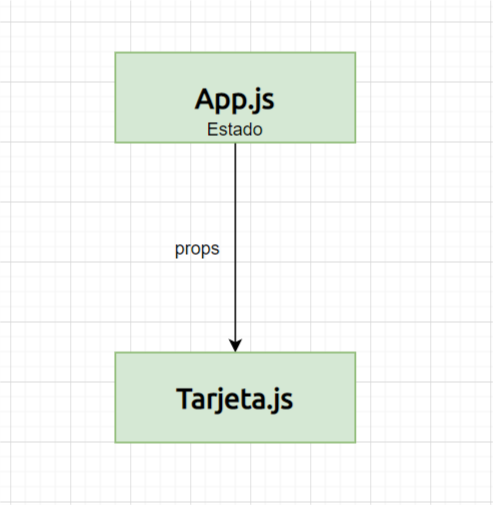
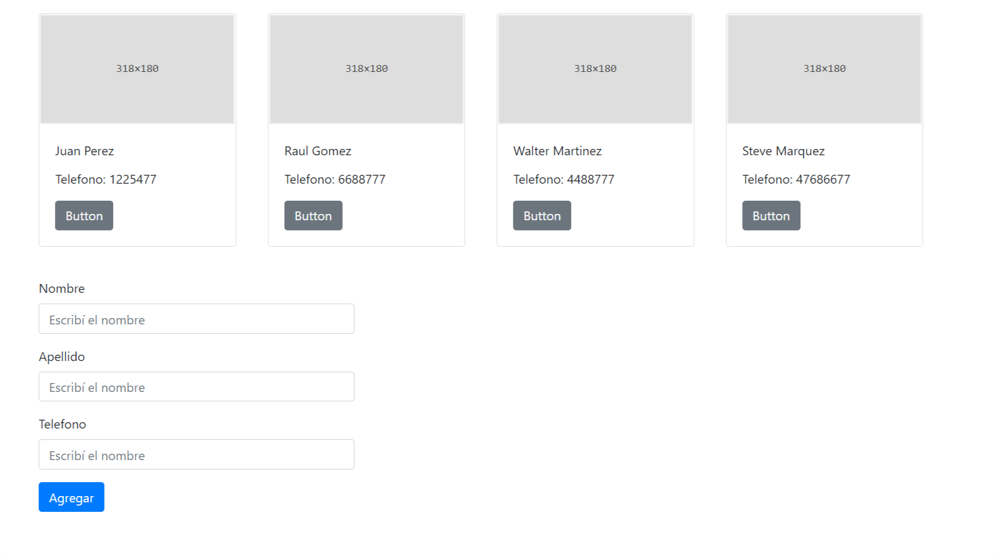
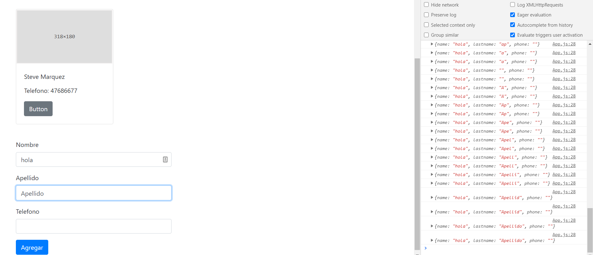

---


title: 'React para principiantes 4'
date: '2020-07-4'
sinopsis: 'Ya tenemos lo principal hecho, ahora vamos con el CRUD, es decir la funcion de create - read - update - delete'
tags: [React, Principiantes]
id: "7"
category: "Front-End"

---

Vamos a presentar el concepto de estado, que al principio puede no ser un concepto fácil de entender.

Básicamente, el estado es data almacenada en principio en nivel de cada componente. Esta data se puede transferir hacia abajo en jerarquía a través de propiedades. 

Entonces, cada componente puede tener su propio estado, y además puede recibir estado de componentes padres a través de propiedades. Y eso es lo que vamos a hacer ahora. Nosotros tenemos nuestro componente padre, **App.js** y en el estado de App.js vamos a tener toda la data de los **contactos** la cual pasaremos a través de **props**, *propiedades*, concepto que ya vimos, toda la data a nuestro componente hijo la tarjeta. Medio dificil de entender, pero ya lo veremos.



Lo primero que hay que hacer es importar los contactos al estado.

De ahi podemos sumar o agregar contactos desde App.js, que es el objectivo de esta aplicación. Es decir, no solamente cargar una lista de contactos, sino modificarla sea sumando, restando o editando.

## Nuestro primer estado

Para trabajar con estado en react usando componentes funcionales, hay que usar la utilidad de los hooks. Es una forma diferente de la cual se usa el estado en los componentes de clases.

Es muy rápido para empezar, primero debemos importar useState del paquete de React, como ya importamos react, debemos agregarlo en la misma linea:

`import React, {useState} from 'react';`

Es importante tener en cuenta que el estado sigue la lógica de las estructuras de datos de javascript, es decir, puede ser un objeto, un array, simplemente un integer, boolean, string e incluso null.

Nosotros, como estamos trabajando con muchos objetos, vamos a utilizar la forma de un array. Entonces, para declararlo podemos simplemente declarar nuestro estado como un array vacío. Pero debemos darle un nombre.

Como trabajamos con contactos, vamos a darle el nombre de **contactList** a nuestro estado ya que la variable contacts ya la hemos usado para importar los contactos iniciales.

Los hooks, vienen con un metodo para actualizarlo también, a este metodo nosotros le ponemos el nombre y en este caso, por convención le pondremos **setContactList**. Nuestro JSX en App.js quedaría asì:

```jsx
import React, {useState} from 'react';
import Tarjeta from './Tarjeta';
import contacts from './contacts.js';
import './App.css'
import 'bootstrap/dist/css/bootstrap.min.css';

function App() {

  const [contactList, setContactList] = useState([])

  const contactsMap = contacts.map((contact) => {
    return(
      <Tarjeta key={contact.phone} name={contact.name} lastname={contact.lastname} phone={contact.phone} />
    )
  })

  return (
    <div className="hola">
        {contactsMap}
    </div>
  );
}

export default App;
```

Ahora, vamos a tomarnos el trabajo de pasar nuestros contactos al estado, para poder ir trabajandolos desde allí.

Quizás se preguntan porque pasamos los contactos al estado si podriamos manipular el array original **contacts** directamente para editar sumar o borrar contactos, esto es clave. Lo hacemos porque cada vez que el estado se modifica React es inteligente y vuelve a renderizar nuestro componente con lo cual vemos de forma inmediata reflejado los cambios. 

Si quieren indagar un poco más sobre como funcioná el estado vean esta introducción al estado que escribí aquí.

Entonces, reestructuraremos nuestra app, para que en vez de crear las tarjetas a partir del import de estado las creemos a partir de nuuestro estado.

```JSX
import React, {useState} from 'react';
import Tarjeta from './Tarjeta';
import contacts from './contacts.js';
import './App.css'
import 'bootstrap/dist/css/bootstrap.min.css';

function App() {

  const [contactList, setContactList] = useState(contacts)

  const contactsMap = contactList.map((contact) => {
    return(
      <Tarjeta key={contact.phone} name={contact.name} lastname={contact.lastname} phone={contact.phone} />
    )
  })

  return (
    <div className="hola">
        {contactsMap}
    </div>
  );
}

export default App;
```

Vean como simplemente metemos nuestro import de **contacts** directo en el useState, y en vez de mapear  **contacts** mapeamos **contactList**

## Agregar contactos nuevos


### Creamos los componentes para agregar contactos
Primero, para poder agregar contactos nuevos, tenemos que hacer varias cosas, y acá se empieza a complejizar un poco, pero es la idea.
Vamos a agregar un formulario con campos de nombre, apellido y telefono para poder agregar un contacto integro nuevo.
Los componentes los vamos a sacar de reactstrap para seguir con toda la linea UX de la aplicación. En nuestro App.js vamos a crear dos secciones, una para las tarjetas de contacto y otra para el formulario para agregar contactos nuevos:

1. Actualizamos nuestro JSX principal, cambiamos el div con clase hola, por un section con clase **contacts-container**
2. Agregamos otro section llamado new contact
3. Agregamos los componentes de reactstrap Form
4. Estilamos con CSS un poco nuestras secciones para que quede asi:



Nuestro JSX completo de **App.js** quedaría así:

```JSX
import React, {useState} from 'react';
import Tarjeta from './Tarjeta';
import contacts from './contacts.js';
import './App.css'
import 'bootstrap/dist/css/bootstrap.min.css';
import { Button, Form, FormGroup, Label, Input } from 'reactstrap';


function App() {

  const [contactList, setContactList] = useState(contacts)

  const contactsMap = contactList.map((contact) => {
    return(
      <Tarjeta key={contact.phone} name={contact.name} lastname={contact.lastname} phone={contact.phone} />
    )
  })

  return (
    <div>
    <section className="contacts-container">
        {contactsMap}
    </section>
    <section className="new-contact">
      <Form>
         <FormGroup>
           <Label for="name">Nombre</Label>
           <Input type="text" name="name" id="name" placeholder="Escribí el nombre" />
          </FormGroup>
          <FormGroup>
           <Label for="lastname">Apellido</Label>
           <Input type="text" name="lastname" id="lastname" placeholder="Escribí el nombre" />
          </FormGroup>
          <FormGroup>
           <Label for="phone">Telefono</Label>
           <Input type="number" name="phone" id="phone" placeholder="Escribí el nombre" />
          </FormGroup>
          <Button color="primary">Agregar</Button>
      </Form>
    </section>
    </div>
  );
}

export default App;

```

y nuestro css

```css

.contacts-container {
  display: flex;
  flex-direction: row;
  flex-wrap: wrap;
  padding: 0 2rem;
}

.new-contact {
  padding: 0 2rem;
}

.new-contact form {
  max-width: 400px;
  margin: 20px;
}

```

Ahora, ahora sí empieza lo jugoso. Para agregar un nuevo contacto tenemos que crear una instancia de estado temporal en donde vamos a guardar lo que escribimos en cada campo de los formularios. Porque magicamente no va a funcionar sino.


1. Primero vamos a crear un estado nuevo, osea otra instancia de useState para poder registrar la data que vamos a ingresar en cada formulario.
2. Luego vamos a crear una nueva función llamada onChange, que lo que va hacer es va a pasar al estado cada cambio que registre en el formulario.
3. Finalmente vamos agregar esta funcion de onChange a cada uno de los inputs. Como estamos registrando el evento (e) en nuestra funciòn on change, podemos repetir la misma expresión por cada input ya que luego, usando el valor target de e podemos registrar individualmente cada input, en la expresion `[e.target.name]: e.target.value` dentro de `onChange()`

Nuestro JSX finalmente quedaría así, agregué los comentarios para que sea más entendible:

```JSX
import React, {useState} from 'react';
import Tarjeta from './Tarjeta';
import contacts from './contacts.js';
import './App.css'
import 'bootstrap/dist/css/bootstrap.min.css';
import { Button, Form, FormGroup, Label, Input } from 'reactstrap';


function App() {
  
  //Estado para registrar que estamos escribiendo en los formularios de agregar nuevos contactos.
  const [data, setData] = useState({
    name: "",
    lastname: "",
    phone: ""
  });

  //Función para agregar al estado cada cosa que se va escribiendo en los formularios, esta funcion se adjunta a cada input
  const onChange = (e) => {
    setData({
      //hacemos un spread de la data que ya existia para poder guardar mas de un componente en nuestro objeto
      ...data,
      [e.target.name]: e.target.value
    })
  }
  //Fijense este console log, va a cambiar cada vez que escribamos algo en nuestros forms.
  console.log(data);


  //Estado que maneja nuestra lista de contactos
  const [contactList, setContactList] = useState(contacts)
  //Mapeo que crea una tarjeta por cada contacto
  const contactsMap = contactList.map((contact) => {
    return(
      <Tarjeta key={contact.phone} name={contact.name} lastname={contact.lastname} phone={contact.phone} />
    )
  })


  //Devolución o return del JSX que crea nuestro HTML a inyectar.
  return (
    <div>
    <section className="contacts-container">
        {contactsMap}
    </section>
    <section className="new-contact">
      <Form>
         <FormGroup>
           <Label for="name">Nombre</Label>
           <Input onChange={e => onChange(e)}  type="text" name="name" id="name" value={data.name}  />
          </FormGroup>
          <FormGroup>
           <Label for="lastname">Apellido</Label>
           <Input onChange={e => onChange(e)}  type="text" name="lastname" id="lastname" value={data.lastname}/>
          </FormGroup>
          <FormGroup>
           <Label for="phone">Telefono</Label>
           <Input onChange={e => onChange(e)}  type="text" name="phone" id="phone" value={data.phone} />
          </FormGroup>
          <Button color="primary">Agregar</Button>
      </Form>
    </section>
    </div>
  );
}

export default App;
```

Ya tenemos registrado los cambios cada vez que escribimos algo, fijense la consola del navegador y veran como registramos cada input:



Ahora nos queda hacer que el boton de Agregar funcione!