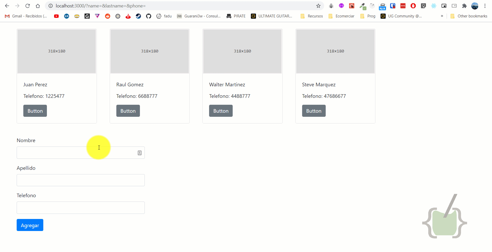
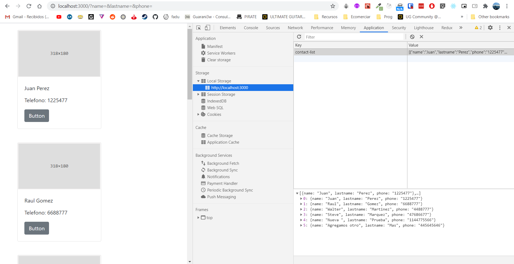

## ¿Cómo guardamos nuestra información?

Hay muchas formas de guardar nuestra información para que no se borre al guardar la pagina. Esto va ser un poquito denso asi que hagamos un café y arranquemos.

En general para guardar información necesitamos alguna especie de base de datos. React trabaja solo con el front end con lo cual si quisieramos interactuar con una base de datos deberiamos armar un back end para ello o usar algun servicio integral como firebase el cual puede relacionarse directamente con un Front End. Armar esto sería completamente un tema aparte de una introduccion al front end. Pero si hay un truquito que podemos hacer, el cual es guardar nuestra información en la memoria local del navegador. De esta manera podremos ver como editar y borrar información y que persista un refresh.

## Localstorage y useEffect

Vamos a guardar toda nuestra data en localStorage, basicamente la memoria de nuestro navegador. Entonces, para asegurarnos de que nuestra data se guarde en la memoria del navegador lo que debemos hacer es armar algun tipo de lógica que dictamine de donde agarrar la data a mostrar en base a si tenemos algo guardado o no.

Para ello vamos a usar un hook llamado useEffect. 

### useEffect

useEffect básicamente nos permite controlar cuantas veces o mejor dicho cuando hacer alguna acción. En nuestro caso queremos que apenas cargue nuestra aplicación, fijarnos en la memoria local a ver si hay algo, y para eso usariamos el hook de esta manera.

```JSX
//Llamamos a useEffect, y dentro del callback vamos a a leer la data si es que hay
useEffect(() => {
    // En pseudocodigo

    // Si hay data guardada en la memoria del navegador pasarla a nuestro estado de contactos,

    // y si no lo hay, crear el objeto a guardar, y guardar nuestra data inicial.


}, [])

```

Podrán ver que después del callback dentro de useEffect hay un array vacío esto significa que queremos que esta función de useEffect corra solamente en la primera renderización de nuestro componente.

### localStorage

Local storage es más facil, es una clase con muchos metodos, que viene incluida con react y directamente la invocamos. Para crear un item hariamos de la siguiente manera

```JSX
 localStorage.setItem('nombre-del-item', 'información a guardar');

```

Sabiendo esto ya podemos componer nuestro useEffect para la primera carga de la data:

```JSX
  useEffect(() => {
    //Llamamos a useEffect, y dentro del callback vamos a a leer la data si es que hay
    const localData = localStorage.getItem('contact-list');
    
    // Si hay data guardada en la memoria del navegador pasarla a nuestro estado de contactos,
    if(localData) {
      setContactList(JSON.parse(localData));
    // y si no lo hay, crear el objeto a guardar, y guardar nuestra data inicial.
    } else {    
      localStorage.setItem('contact-list', JSON.stringify(contactList));
    }

  }, [])

```

Finalmente, nos quedaría componer un ultimo useEffect, para que? Y para que cuando agreguemos un contacto directamente se agregue a nuestro localStorage. Si lo dejamos así lo unico que estariamos haciendo es cargar del localstorage la misma información que tenemos disponible desde el **contact.js**

Haríamos lo siguiente:

```JSX
  useEffect(() => {

    localStorage.setItem('contact-list', JSON.stringify(contactList))

  }, [contactList]);  
  
```

Fijensé que este useEffect no tiene el array vacío despues del callback. Esto quiere decir que este useEffect va a correr cada vez que cambie la información guardada dentro nuestro **contactList**. Buenísimo, osea que cada vez que agregamos un contacto se va a guardar directamente a nuestro **localStorage**

Hagán la prueba, agreguen un nuevo contacto y denle refresh:



Finalmente, si quieren borrar la data, pueden entrar en chrome a la consola haciendo control+shift+I, van Application y hacen click en LocalStorage, van a tener ahi data del localhost:3000 que es nuestra app:




En el proximo capitulo veremos como borrar contactos.